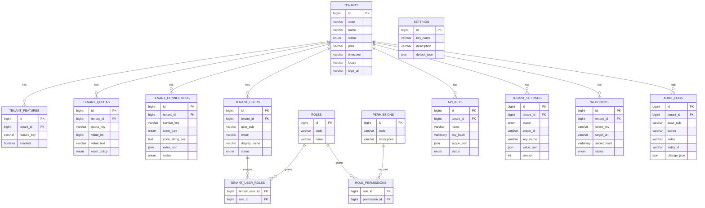

```mermaid
erDiagram
    TENANTS {
        bigint id PK
        varchar code
        varchar name
        enum status
        varchar plan
        varchar timezone
        varchar locale
        varchar logo_url
    }

    TENANT_FEATURES {
        bigint id PK
        bigint tenant_id FK
        varchar feature_key
        boolean enabled
    }

    TENANT_QUOTAS {
        bigint id PK
        bigint tenant_id FK
        varchar quota_key
        bigint value_int
        varchar value_text
        enum reset_policy
    }

    TENANT_CONNECTIONS {
        bigint id PK
        bigint tenant_id FK
        varchar service_key
        enum conn_type
        text conn_string_enc
        json extra_json
        enum status
    }

    ROLES {
        bigint id PK
        varchar code
        varchar name
    }

    PERMISSIONS {
        bigint id PK
        varchar code
        varchar description
    }

    ROLE_PERMISSIONS {
        bigint role_id FK
        bigint permission_id FK
    }

    TENANT_USERS {
        bigint id PK
        bigint tenant_id FK
        varchar user_sub
        varchar email
        varchar display_name
        enum status
    }

    TENANT_USER_ROLES {
        bigint tenant_user_id FK
        bigint role_id FK
    }

    API_KEYS {
        bigint id PK
        bigint tenant_id FK
        varchar name
        varbinary key_hash
        json scope_json
        enum status
    }

    SETTINGS {
        bigint id PK
        varchar key_name
        varchar description
        json default_json
    }

    TENANT_SETTINGS {
        bigint id PK
        bigint tenant_id FK
        enum scope
        varchar scope_id
        varchar key_name
        json value_json
        int version
    }

    WEBHOOKS {
        bigint id PK
        bigint tenant_id FK
        varchar event_key
        varchar target_url
        varbinary secret_hash
        enum status
    }

    AUDIT_LOGS {
        bigint id PK
        bigint tenant_id FK
        varchar actor_sub
        varchar action
        varchar entity
        varchar entity_id
        json change_json
    }

    %% Relationships
    TENANTS ||--o{ TENANT_FEATURES : has
    TENANTS ||--o{ TENANT_QUOTAS : has
    TENANTS ||--o{ TENANT_CONNECTIONS : has
    TENANTS ||--o{ TENANT_USERS : has
    TENANTS ||--o{ API_KEYS : has
    TENANTS ||--o{ TENANT_SETTINGS : has
    TENANTS ||--o{ WEBHOOKS : has
    TENANTS ||--o{ AUDIT_LOGS : logs

    ROLES ||--o{ ROLE_PERMISSIONS : grants
    PERMISSIONS ||--o{ ROLE_PERMISSIONS : includes

    TENANT_USERS ||--o{ TENANT_USER_ROLES : assigns
    ROLES ||--o{ TENANT_USER_ROLES : grants

```