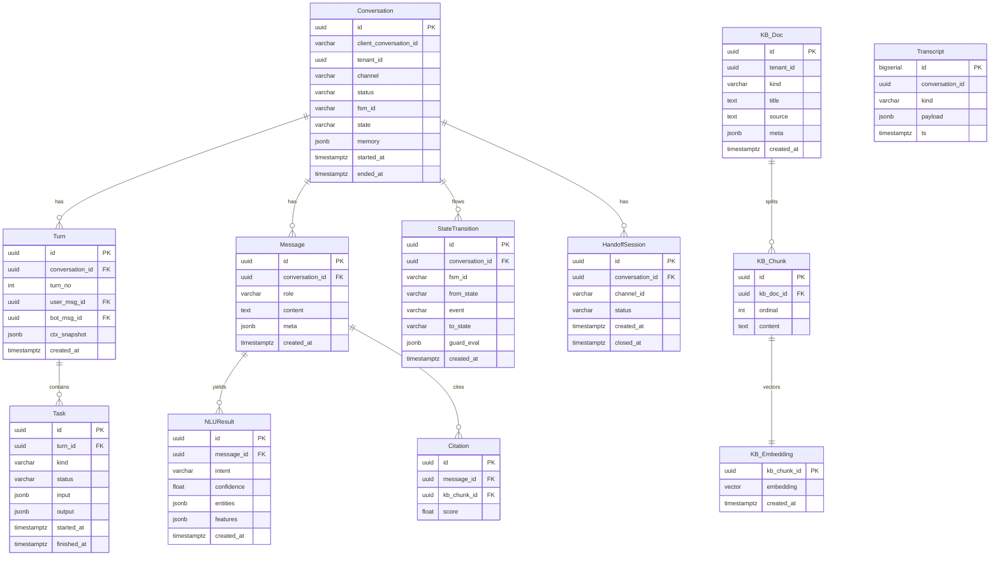

```mermaid
erDiagram
  Conversation ||--o{ Turn : has
  Conversation ||--o{ Message : has
  Conversation ||--o{ StateTransition : flows
  Conversation ||--o{ HandoffSession : has
  Turn ||--o{ Task : contains
  Message ||--o{ NLUResult : yields
  Message ||--o{ Citation : cites
  KB_Doc ||--o{ KB_Chunk : splits
  KB_Chunk ||--|| KB_Embedding : vectors

  Conversation {
    uuid id PK
    %% client-provided id to map client<->server conversations
    varchar client_conversation_id
    %% tenant_id references external Admin/Tenant service
    uuid tenant_id
    varchar channel
    %% status: active, paused, ended
    varchar status
    %% fsm_id: versioned fsm, e.g., chat_service@v1
    varchar fsm_id
    %% state: current nested state (dot-path), e.g., FLOW_ISSUE_TICKET.GATHER
    varchar state
    %% memory: key slots/short ctx
    jsonb  memory
    timestamptz started_at
    timestamptz ended_at
  }

  Turn {
    uuid id PK
    uuid conversation_id FK
    int  turn_no
    uuid user_msg_id FK
    uuid bot_msg_id FK
    jsonb ctx_snapshot
    timestamptz created_at
    %% unique: (conversation_id, turn_no)
  }

  %% Uniqueness recommendation for mapping client/server ids
  %% unique: (tenant_id, channel, client_conversation_id)

  Message {
    uuid id PK
    uuid conversation_id FK
    %% role: user, assistant, tool, system
    varchar role
    text content
    %% meta: token, model, tool_name...
    jsonb meta
    timestamptz created_at
  }

  Transcript {
    bigserial id PK
    uuid conversation_id
    %% kind: user_msg, bot_msg, tool_req, tool_res, transition
    varchar kind
    jsonb payload
    %% ts default: now()
    timestamptz ts
  }

  Task {
    uuid id PK
    uuid turn_id FK
    %% kind: rag_retrieve, call_api, validate_slots, summarize,
    %%       create_ticket, get_route, query_procedure_kb, query_triage_kb
    varchar kind
    %% status: pending, running, success, error, timeout, canceled
    varchar status
    jsonb input
    jsonb output
    timestamptz started_at
    timestamptz finished_at
  }

  StateTransition {
    uuid id PK
    uuid conversation_id FK
    varchar fsm_id
    %% from/to use dot-paths for nested states
    varchar from_state
    %% event: USER_MESSAGE | SLOT_FILLED | CONFIRM_YES | CONFIRM_NO | CANCEL_FLOW | TIMEOUT
    varchar event
    varchar to_state
    jsonb  guard_eval
    timestamptz created_at
  }

  HandoffSession {
    uuid id PK
    uuid conversation_id FK
    varchar channel_id
    %% status: open, closed
    varchar status
    timestamptz created_at
    timestamptz closed_at
  }

  NLUResult {
    uuid id PK
    uuid message_id FK
    varchar intent
    float  confidence
    %% entities: {slot: value}
    jsonb  entities
    %% features: logits, embedding_id...
    jsonb  features
    timestamptz created_at
  }

  Citation {
    uuid id PK
    uuid message_id FK
    uuid kb_chunk_id FK
    float score
  }

  KB_Doc {
    uuid id PK
    %% tenant_id references external Admin/Tenant service
    uuid tenant_id
    %% kind: procedure | navigation | faq | general | policy
    varchar kind
    text title
    text source
    jsonb meta
    timestamptz created_at
  }

  KB_Chunk {
    uuid id PK
    uuid kb_doc_id FK
    int  ordinal
    text content
  }

  KB_Embedding {
    uuid kb_chunk_id PK
    %% embedding type: pgvector
    vector embedding
    timestamptz created_at
  }
  %% Note: User and Tenant are external services.
  %% Only IDs are stored locally; existence validated via APIs or cache.

```
