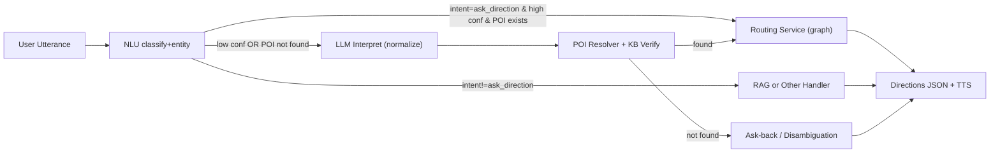
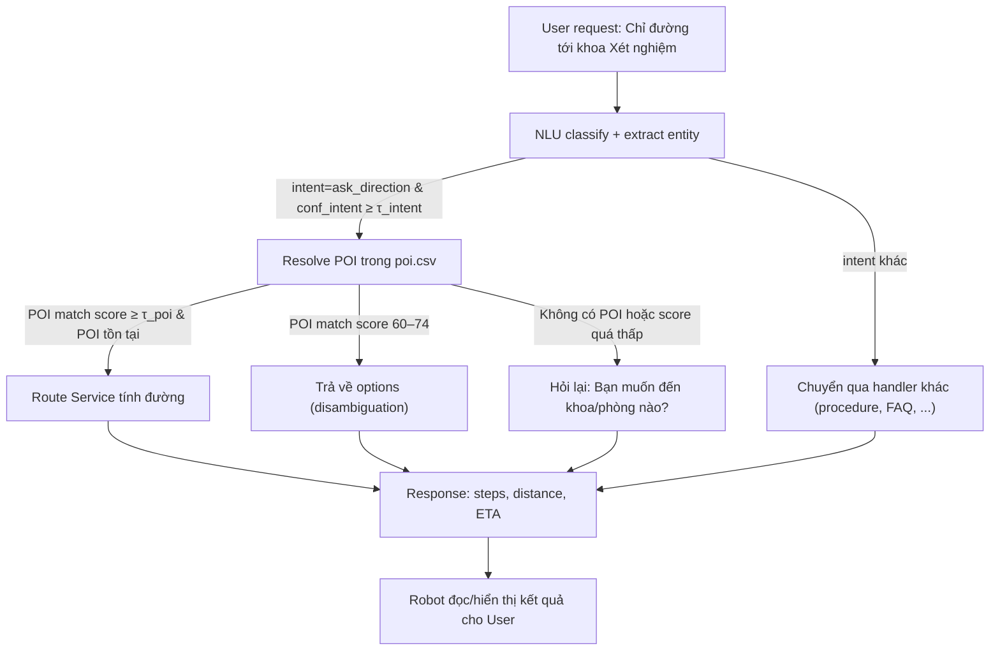
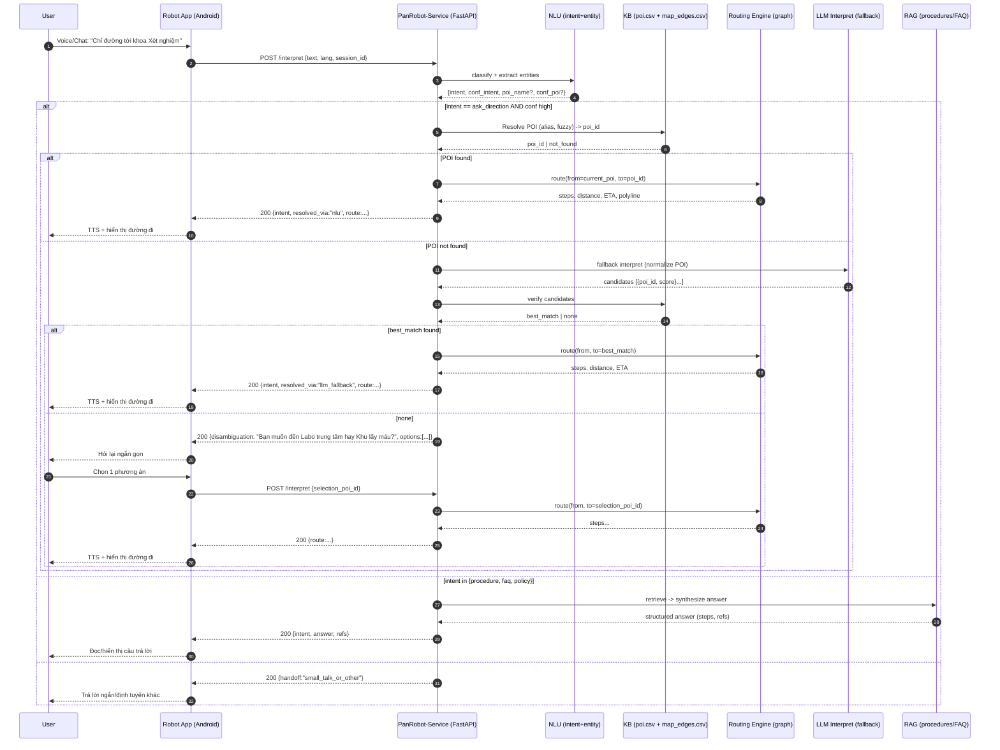

# Flowchart

```mermaid
flowchart LR
A[User Utterance] --> B[NLU classify+entity]
B -->|intent=ask_direction & high conf & POI exists| C["Routing Service (graph)"]
B -->|intent!=ask_direction| D[RAG or Other Handler]
B -->|low conf OR POI not found| E["LLM Interpret (normalize)"]
E --> F[POI Resolver + KB Verify]
F -->|found| C
F -->|not found| G[Ask-back / Disambiguation]
C --> H[Directions JSON + TTS]
D --> H
G --> H

```
# NLU -> routing (No fallback)

```mermaid
flowchart TD
    A[User request: Chỉ đường tới khoa Xét nghiệm] --> B[NLU classify + extract entity]

    B -->|intent=ask_direction & conf_intent ≥ τ_intent| C[Resolve POI trong poi.csv]
    B -->|intent khác| D["Chuyển qua handler khác (procedure, FAQ, ...)"]

    C -->|POI match score ≥ τ_poi & POI tồn tại| E[Route Service tính đường]
    C -->|POI match score 60–74| F["Trả về options (disambiguation)"]
    C -->|Không có POI hoặc score quá thấp| G[Hỏi lại: Bạn muốn đến khoa/phòng nào?]

    E --> H[Response: steps, distance, ETA]
    F --> H
    G --> H
    D --> H

    H --> I[Robot đọc/hiển thị kết quả cho User]

```
# Sequence Diagram NLU + Fallback LLM

```mermaid
sequenceDiagram
    autonumber
    participant U as User
    participant A as Robot App (Android)
    participant S as PanRobot-Service (FastAPI)
    participant N as NLU (intent+entity)
    participant KB as KB (poi.csv + map_edges.csv)
    participant R as Routing Engine (graph)
    participant L as LLM Interpret (fallback)
    participant G as RAG (procedures/FAQ)

    U->>A: Voice/Chat: "Chỉ đường tới khoa Xét nghiệm"
    A->>S: POST /interpret {text, lang, session_id}

    S->>N: classify + extract entities
    N-->>S: {intent, conf_intent, poi_name?, conf_poi?}

    alt intent == ask_direction AND conf high
        S->>KB: Resolve POI (alias, fuzzy) -> poi_id
        KB-->>S: poi_id | not_found

        alt POI found
            S->>R: route(from=current_poi, to=poi_id)
            R-->>S: steps, distance, ETA, polyline
            S-->>A: 200 {intent, resolved_via:"nlu", route:...}
            A-->>U: TTS + hiển thị đường đi
        else POI not found
            S->>L: fallback interpret (normalize POI)
            L-->>S: candidates [{poi_id, score}...]
            S->>KB: verify candidates
            KB-->>S: best_match | none

            alt best_match found
                S->>R: route(from, to=best_match)
                R-->>S: steps, distance, ETA
                S-->>A: 200 {intent, resolved_via:"llm_fallback", route:...}
                A-->>U: TTS + hiển thị đường đi
            else none
                S-->>A: 200 {disambiguation: "Bạn muốn đến Labo trung tâm hay Khu lấy máu?", options:[...]}
                A-->>U: Hỏi lại ngắn gọn
                U->>A: Chọn 1 phương án
                A->>S: POST /interpret {selection_poi_id}
                S->>R: route(from, to=selection_poi_id)
                R-->>S: steps...
                S-->>A: 200 {route:...}
                A-->>U: TTS + hiển thị đường đi
            end
        end

    else intent in {procedure, faq, policy}
        S->>G: retrieve -> synthesize answer
        G-->>S: structured answer (steps, refs)
        S-->>A: 200 {intent, answer, refs}
        A-->>U: Đọc/hiển thị câu trả lời
    else
        S-->>A: 200 {handoff:"small_talk_or_other"}
        A-->>U: Trả lời ngắn/định tuyến khác
    end

```