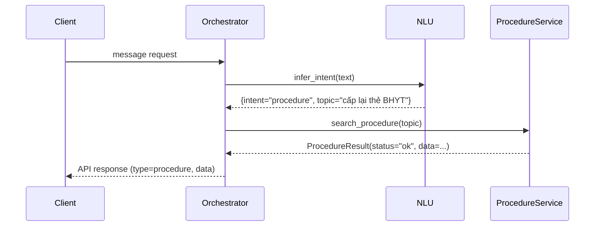

```mermaid
sequenceDiagram
    participant Client
    participant Orchestrator
    participant NLU
    participant ProcedureService

    Client->>Orchestrator: message request
    Orchestrator->>NLU: infer_intent(text)
    NLU-->>Orchestrator: {intent="procedure", topic="cấp lại thẻ BHYT"}
    Orchestrator->>ProcedureService: search_procedure(topic)
    ProcedureService-->>Orchestrator: ProcedureResult(status="ok", data=...)
    Orchestrator-->>Client: API response (type=procedure, data)

```