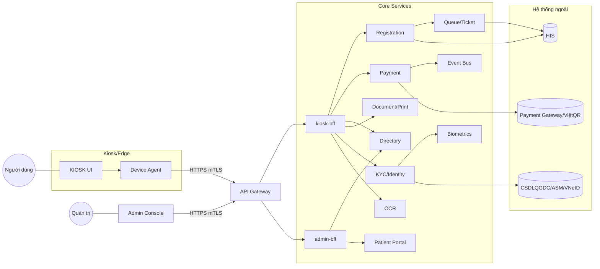
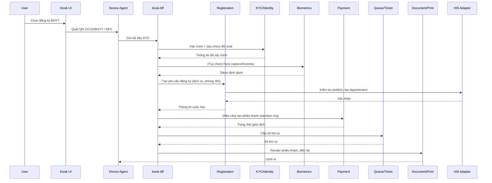
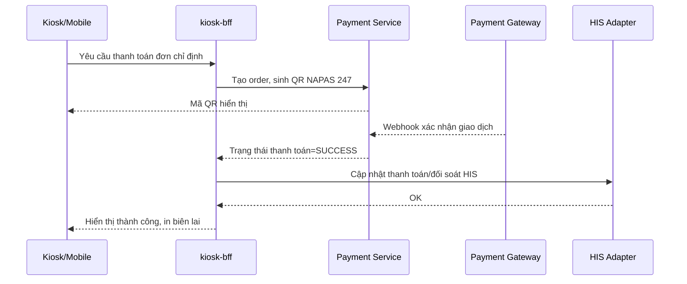
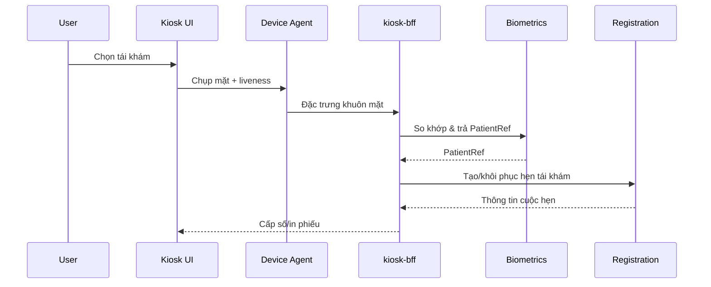
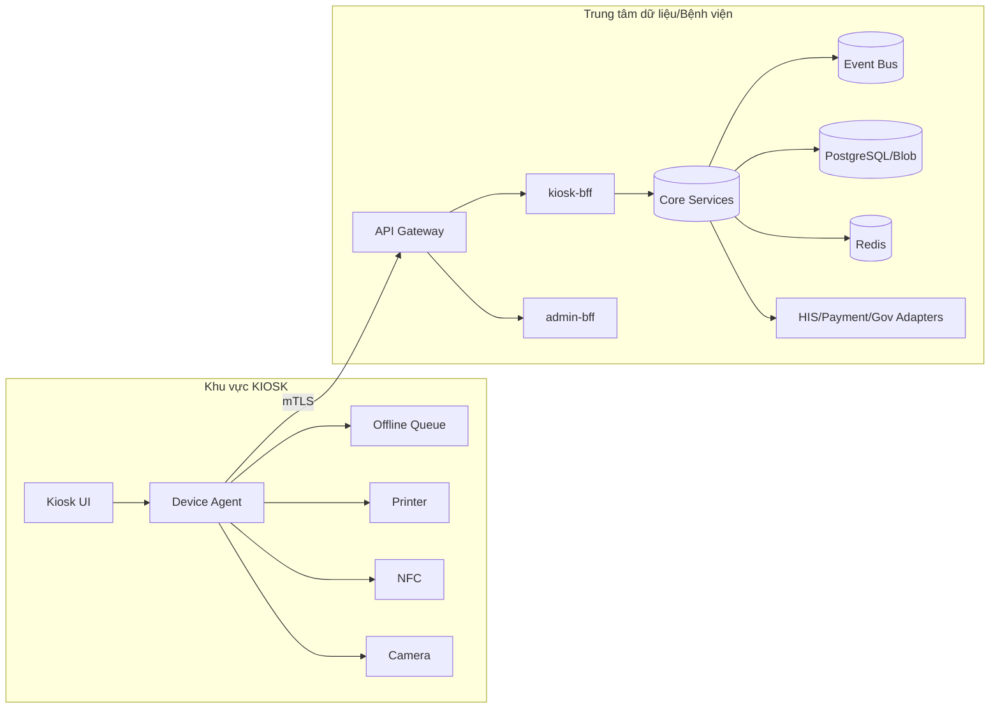

# Kiến trúc Hệ thống KIOSK – Tiếp đón – Quản trị Tập trung

Tài liệu ở mức kiến trúc (architecture level), mô tả theo 4 chiều: Characteristics, Architectural Decisions, Logical Components, Architectural Styles. Các sơ đồ minh họa dùng Mermaid để nắm bức tranh tổng thể; không đi sâu chi tiết triển khai.

---

## 1) Characteristics (Phi chức năng)

- Bảo mật & tuân thủ: mã hóa in‑transit (mTLS) và at‑rest, OAuth2/OIDC, RBAC/ABAC, audit trail; đáp ứng PCI‑DSS (thanh toán) và chuẩn y tế (HL7/FHIR) nơi áp dụng; tối thiểu hóa lưu PHI.
- Sẵn sàng & chống gián đoạn: HA cho dịch vụ lõi; KIOSK hỗ trợ offline tạm thời với hàng đợi cục bộ và đồng bộ khi online.
- Khả năng mở rộng: scale‑out theo dịch vụ; cache/replica cho đọc; broker cho xử lý bất đồng bộ.
- Liên thông & chuẩn dữ liệu: FHIR/HL7 v2, ISO7816 (NFC), QR CCCD/BHYT, ViệtQR/NAPAS 247; adapter để tích hợp HIS/ASM/VNeID.
- Hiệu năng trải nghiệm: tra cứu cache‑hit < 300ms; quy trình đăng ký ≤ 60s gồm KYC, thanh toán, in ấn.
- Quan sát hệ thống: centralized logging, metrics, tracing, heartbeat KIOSK, OTA update, cấu hình từ xa.
- Đa bệnh viện/multi‑tenant: phân vùng theo tenant, cấu hình kết nối HIS/thanh toán theo bệnh viện, giới hạn truy cập theo phạm vi.
- Mở rộng AI: tách mô‑đun OCR/ASR/Face ID; hỗ trợ triển khai on‑prem hoặc cloud/hybrid.

---

## 2) Architectural Decisions (Quyết định kiến trúc)

- Phân rã microservices + event‑driven; mỗi service sở hữu dữ liệu domain của mình (own‑your‑data).
- API Gateway + BFF: `kiosk-bff` và `admin-bff` để tối ưu payload, policy, và trải nghiệm theo kênh.
- Orchestration bằng workflow engine/Saga cho chuỗi Đăng ký → Thanh toán → Cấp số → In → Đồng bộ HIS, có bước bù trừ (compensation).
- CQRS: kênh đọc qua cache/read model; kênh ghi qua command bus, đảm bảo nhất quán cuối cùng.
- Message broker (Kafka/RabbitMQ) với outbox pattern tránh mất sự kiện/lặp.
- Edge computing tại KIOSK: agent cục bộ điều khiển thiết bị (NFC/QR/Camera/Printer), cache cấu hình, queue offline.
- Bảo mật: OIDC với nhà cung cấp IAM; mTLS nội bộ; secret manager; tokenization/redirect qua cổng thanh toán (không xử lý PAN trực tiếp).
- Dữ liệu & BI: Postgres cho dịch vụ; Redis cho cache/session/rate‑limit; kho dữ liệu/BI tách biệt cho báo cáo.
- OTA & Quản trị thiết bị: remote config có chữ ký, kiểm soát phiên bản, health check/telemetry; nhật ký hoạt động KIOSK.

---

## 3) Logical Components (Thành phần logic)

Nhóm kênh người dùng
- Kiosk UI (đa ngôn ngữ, trợ lý giọng nói) – tra cứu, đăng ký, thanh toán, lấy số, in phiếu.
- Admin Console – quản trị người dùng, danh mục, lịch bác sĩ, cấu hình HIS/Payment, OTA, báo cáo.
- Mobile/VNeID – định danh, tái khám, thanh toán, nhận thông báo.

Tầng biên/KIOSK
- Device Agent: điều khiển NFC (ISO7816), QR/Barcode, Camera/Face, Scanner ADF, Printer/Ticket; hàng đợi cục bộ; đồng bộ nền.
- Edge services: Local Print, Driver Bridge, Config Cache, Offline Queue.

Gateway & BFF
- API Gateway: routing, WAF, authn/z, rate‑limit, mTLS.
- kiosk‑bff, admin‑bff: tổng hợp API cho từng UI, tối ưu latency/payload.

Dịch vụ lõi
- Identity & Access (IAM) – OIDC, RBAC/ABAC, liên kết CCCD/BHYT/VNeID.
- KYC/Identity – đọc QR CCCD/BHYT, NFC chip; đối soát CSDLQGDC/VNeID (qua adapter), quản lý consent.
- Biometrics – Face/liveness, định danh tái khám.
- OCR – quét 2 mặt CCCD/giấy tờ, trích xuất có confidence.
- ASR/STT & Voice Assistant – nhập liệu/ra lệnh bằng giọng nói, gợi ý dịch vụ/phòng/BS.
- Directory – danh mục dịch vụ/phòng/BS/lịch; đồng bộ từ HIS.
- Wayfinding – bản đồ/sơ đồ nội viện, điều hướng.
- Registration – đăng ký khám tự nguyện/BHYT; tái khám bằng khuôn mặt.
- Queue/Ticket – cấp số thứ tự, phân luồng quầy, màn hình hiển thị.
- Payment – tích hợp cổng trung gian & ViệtQR/NAPAS 247; theo dõi trạng thái, đối soát.
- Order/Billing – chỉ định CLS, tạm ứng, hóa đơn/biên lai.
- Document/Print – render và in phiếu khám/số thứ tự/biên lai (template theo bệnh viện).
- Patient Portal – lịch sử khám, kết quả, toa thuốc (đọc HIS/FHIR).
- Notification – SMS/Email/Zalo/Push.
- Config/Feature Flag – cấu hình đa tenant, phát hành OTA.
- Kiosk Management – đăng ký thiết bị, heartbeat, firmware/app version, log hoạt động.
- Report/Analytics – đăng ký/doanh thu/SLA/sử dụng KIOSK.
- Audit/Logging – audit trail, tuân thủ, lưu trữ có TTL.

Tích hợp ngoài
- HIS Adapter – REST/HL7/FHIR, mapping tài nguyên, circuit breaker, retry.
- Payment Gateway Adapter – cổng thanh toán, ViệtQR 247.
- Gov/ASM/VNeID Adapters – dân cư quốc gia, khai báo lưu trú, đăng nhập/định danh VNeID.

Nền tảng chung
- Event Bus, Workflow Orchestrator, Redis Cache, Secrets Manager, Monitoring/Tracing, API Catalog.

Lưu trữ
- Mỗi service một DB (PostgreSQL), blob store cho ảnh/scan đã làm mờ, warehouse cho BI; chính sách retention/TTL.

---

## 4) Architectural Styles (Phong cách kiến trúc)

- Microservices + event‑driven; giao tiếp async qua broker, sync qua REST/gRPC.
- Hexagonal (Ports & Adapters) cho từng service, tách domain logic khỏi adapter HIS/Payment/Gov.
- CQRS cho tra cứu/đăng ký; read model được materialize và cache.
- Saga/Process Manager để điều phối quy trình đăng ký–thanh toán–HIS–in, có compensation.
- Backend‑for‑Frontend cho `kiosk-bff` và `admin-bff`.
- Edge/Offline‑first trên KIOSK với sync‑queue, idempotency.
- Strangler‑fig khi thay thế/tích hợp dần với HIS cũ.
- Zero‑trust nội bộ, mTLS, policy enforcement tại Gateway.

---

## Sơ đồ bối cảnh (Context)

---

## Luồng chính (High‑level)

Đăng ký BHYT tại KIOSK

Thanh toán ViệtQR/NAPAS 247

Tái khám bằng khuôn mặt

---

## Deployment (triển khai ở mức cao)

---

## Dữ liệu & tích hợp (tóm tắt)

- Tài nguyên FHIR chủ đạo: Patient, Practitioner, Organization, Coverage, Appointment, Encounter, ServiceRequest, Observation (kết quả), Invoice/PaymentNotice.
- Mapping qua HIS Adapter; cơ chế circuit breaker, retry, idempotency key để chống lặp.
- Ảnh/scan lưu ở blob store, áp dụng làm mờ/thẻ hóa; liên kết bằng khóa tham chiếu, hạn chế lưu PII/PHI.

---

## Bảo mật & tuân thủ

- OIDC/OAuth2, MFA cho Admin; RBAC/ABAC theo tenant và vai trò.
- mTLS giữa dịch vụ; secret/credential quản lý bởi secret manager; ký số/tem chống giả mạo cho OTA.
- Audit trail bất biến; chính sách retention, quyền truy cập tối thiểu (least privilege).
- PCI‑DSS: chuyển hướng/tách miền thanh toán; không lưu PAN; tokenization từ cổng trung gian.

---

## Vận hành & quan sát

- Log, metrics, tracing tập trung; health/heartbeat KIOSK; cảnh báo dựa trên SLA.
- Quản trị cấu hình & OTA theo nhóm KIOSK; rolling update; feature flag theo tenant/cơ sở.
- Báo cáo/BI: số lượt đăng ký, lịch sử, doanh thu; tách hạ tầng phân tích khỏi OLTP.

---

## Phạm vi chức năng (tổng hợp từ yêu cầu)

- Tra cứu: đường đi/sơ đồ, vị trí phòng ban; dịch vụ y tế & giá; quy trình khám chữa bệnh.
- Tiếp nhận & xử lý: quét QR CCCD/BHYT, đọc NFC ISO7816, OCR 2 mặt CCCD; định danh sinh trắc; đăng ký khám tự nguyện/BHYT; lấy số; in phiếu/biên lai; truy cập lịch sử/kết quả/toa thuốc; thanh toán trực tuyến (cổng trung gian/ViệtQR 247); thanh toán chỉ định CLS, tạm ứng.
- Quản trị tập trung: tài khoản & phân quyền; cấu hình/OTA KIOSK; danh mục dịch vụ, phòng khám, BS, lịch; báo cáo thống kê; log hoạt động thiết bị; cấu hình HIS & thanh toán; quản lý nhiều KIOSK/nhiều cơ sở; tích hợp ví/cổng; đăng ký qua VNeID; khai báo lưu trú ASM.
- Tính năng AI: STT/ASR ra lệnh & nhập liệu; trợ lý ảo gợi ý chọn dịch vụ/phòng/BS.

---

## Ghi chú

- Tài liệu này là baseline kiến trúc; chi tiết schema, hợp đồng API, tiêu chí SLO/SLA và ma trận quyền sẽ được mô tả ở tài liệu thiết kế thấp tầng (LLD) và API spec riêng.

