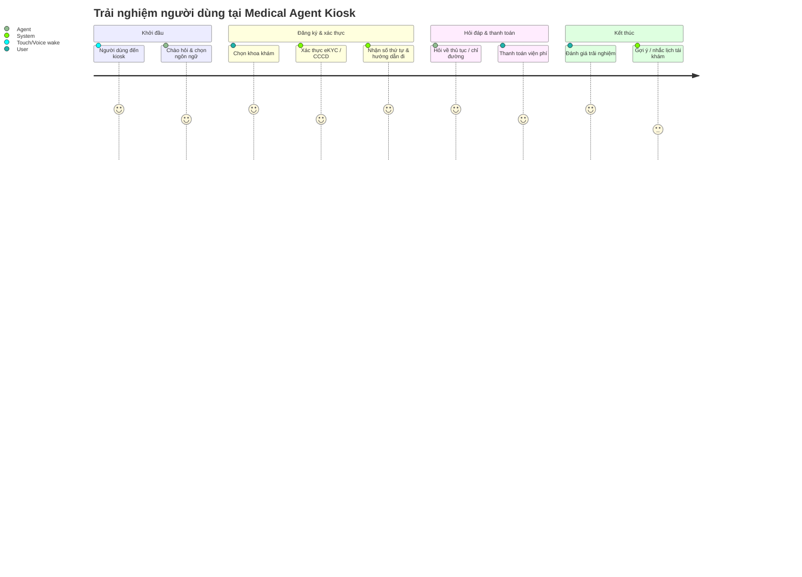

# 🏥 Medical Agent Kiosk – Danh sách chức năng hệ thống

---

## 1. Nhóm chức năng dành cho **người dùng tại kiosk (Patient / Visitor)**

### A. Tương tác chính
| Mã chức năng | Tên chức năng | Mô tả |
|---------------|---------------|-------|
| `PAT-001` | **Chào hỏi & khởi tạo hội thoại (Voice/Text)** | Hệ thống nhận tín hiệu khởi đầu (qua giọng nói, chạm màn hình) và bắt đầu session hội thoại. |
| `PAT-002` | **Bốc số khám / Lấy phiếu khám bệnh** | Người dùng chọn khoa/phòng khám, hệ thống tạo ticket hàng chờ (queue ticket) và in/hiển thị số thứ tự. |
| `PAT-003` | **Tra cứu hướng dẫn thủ tục** | Hỏi – đáp về quy trình đăng ký, đóng viện phí, nhận thuốc, xét nghiệm… |
| `PAT-004` | **Chỉ đường đến phòng khám (Wayfinding)** | Dẫn đường bằng sơ đồ (map) và hướng dẫn bằng text/voice tới địa điểm mong muốn. |
| `PAT-005` | **Tra cứu thông tin cá nhân (E-KYC)** | Xác thực bằng CCCD, mã QR BHYT hoặc khuôn mặt để định danh bệnh nhân. |
| `PAT-006` | **Tra cứu kết quả khám / lịch hẹn** | Hiển thị kết quả, lịch hẹn, đơn thuốc đã có trên hệ thống (qua API tới HIS). |
| `PAT-007` | **Thanh toán viện phí / dịch vụ** | Hỗ trợ thanh toán không tiền mặt (QR/Zalopay, VNPay, thẻ ngân hàng). |
| `PAT-008` | **Đánh giá trải nghiệm dịch vụ** | Sau khi hoàn thành, người dùng có thể đánh giá mức độ hài lòng. |

---

## 2. Nhóm chức năng **AI / Conversational Agent**

| Mã | Tên chức năng | Mô tả |
|----|----------------|-------|
| `AI-001` | **NLU (Natural Language Understanding)** | Phân tích câu nói của người dùng để xác định intent, entity, slot. |
| `AI-002` | **Dialogue Orchestrator** | Quản lý luồng hội thoại (state machine), gọi các service phù hợp (E-KYC, Queue, Map...). |
| `AI-003` | **Knowledge Base (RAG / Rule-based)** | Cung cấp câu trả lời cho các câu hỏi quy trình, chỉ dẫn, thủ tục. |
| `AI-004` | **Text-to-Speech (TTS) & Speech-to-Text (STT)** | Chuyển đổi giọng nói ↔ văn bản (frontend hoặc external service). |
| `AI-005` | **Context & Slot Memory** | Ghi nhớ thông tin hội thoại (khoa, phòng, tên người dùng, ticket…). |
| `AI-006` | **Multi-language support** | Hỗ trợ hội thoại song ngữ (Việt / Anh). |

---

## 3. Nhóm chức năng **vận hành nội bộ & nhân viên y tế**

| Mã | Tên chức năng | Mô tả |
|----|----------------|-------|
| `OPS-001` | **Dashboard giám sát kiosk** | Theo dõi trạng thái hoạt động, session, số lượt phục vụ. |
| `OPS-002` | **Quản lý hàng chờ (Queue Monitor)** | Theo dõi tình trạng hàng chờ theo khoa/phòng, cập nhật trạng thái. |
| `OPS-003` | **Quản lý quy trình & hướng dẫn (Procedure CMS)** | Tạo/chỉnh sửa nội dung hướng dẫn thủ tục, quy trình khám, nhập viện, thanh toán. |
| `OPS-004` | **Quản lý điểm quan tâm (POI Map Editor)** | Quản lý bản đồ khu vực bệnh viện (phòng khám, quầy thu ngân, nhà thuốc...). |
| `OPS-005` | **Thống kê & báo cáo sử dụng** | Thống kê lượt truy cập, tần suất intent, thời lượng trung bình, feedback. |
| `OPS-006` | **Cấu hình multi-tenant** | Thiết lập thông tin cho từng bệnh viện: logo, màu sắc, danh mục khoa/phòng, phương thức thanh toán. |

---

## 4. Nhóm chức năng **hệ thống & backend**

| Mã | Tên chức năng | Mô tả |
|----|----------------|-------|
| `SYS-001` | **Gateway & Routing** | Điều phối request giữa kiosk frontend và các service backend. |
| `SYS-002` | **Conversation Service (State & Transcript)** | Lưu trạng thái hội thoại, lịch sử trao đổi, task hiện tại. |
| `SYS-003` | **NLU Service** | Phân tích intent và entity (có thể dùng LLM hoặc rule-base). |
| `SYS-004` | **Queue Service** | Quản lý hàng chờ, số thứ tự, trạng thái ticket. |
| `SYS-005` | **Map Service** | Cung cấp dữ liệu vị trí và đường đi (POI, edge graph). |
| `SYS-006` | **Procedure Service** | Trả về thông tin quy trình, thủ tục, hướng dẫn. |
| `SYS-007` | **Admin Service (multi-tenant)** | Lưu cấu hình bệnh viện, khoa, giá, thanh toán, user admin. |
| `SYS-008` | **E-KYC & Auth Service** | Xác thực danh tính qua CCCD, khuôn mặt, mã BHYT, OTP. |
| `SYS-009` | **Billing & Payment Service** | Quản lý nghiệp vụ thanh toán, hóa đơn, tích hợp cổng thanh toán. |
| `SYS-010` | **Logging & Monitoring** | Ghi log, theo dõi event, error tracking. |
| `SYS-011` | **Notification / Event Bus** | Thông báo trạng thái ticket, push message cho UI. |

---

## 5. Nhóm chức năng **bảo mật & quản trị**

| Mã | Tên chức năng | Mô tả |
|----|----------------|-------|
| `SEC-001` | **Quản lý người dùng & phân quyền** | Admin, nhân viên, kiosk client. |
| `SEC-002` | **Audit trail & log truy cập** | Ghi lại hoạt động người dùng, thay đổi dữ liệu. |
| `SEC-003` | **Token-based Auth (JWT/OAuth2)** | Bảo vệ API và session. |
| `SEC-004` | **Anonymization & PHI/PII Control** | Bảo vệ dữ liệu cá nhân theo chuẩn y tế (ẩn danh hóa). |

---

## 6. (Tuỳ chọn nâng cao)

| Mã | Tên chức năng | Mô tả |
|----|----------------|-------|
| `AI-007` | **Predictive queue time / load balancing** | Dự đoán thời gian chờ và phân bổ bệnh nhân hợp lý. |
| `AI-008` | **Agent Learning / Feedback loop** | Cải thiện hội thoại dựa trên feedback người dùng. |
| `SYS-012` | **Offline Mode (Edge caching)** | Dự phòng cho trường hợp mất kết nối mạng. |

---

# 👩‍⚕️ Medical Agent Kiosk – Nhóm chức năng từ góc nhìn **Customer (Bệnh nhân / Khách đến bệnh viện)**

> Góc nhìn này tập trung vào **trải nghiệm người dùng đầu cuối** — những gì bệnh nhân có thể **thực hiện, nhìn thấy và tương tác** trực tiếp tại kiosk hoặc qua hội thoại với medical agent.

---

## 1. **Khởi tạo & Tương tác ban đầu**

| Nhóm | Mã | Tên chức năng | Mô tả |
|------|----|----------------|-------|
| Trải nghiệm hội thoại | `CUS-001` | **Chào hỏi – Bắt đầu hội thoại** | Hệ thống nhận diện người dùng (qua chạm hoặc giọng nói) và chào hỏi thân thiện. |
| Trải nghiệm hội thoại | `CUS-002` | **Chọn ngôn ngữ giao tiếp** | Người dùng có thể chọn tiếng Việt hoặc tiếng Anh. |
| Trải nghiệm hội thoại | `CUS-003` | **Nhập hoặc nói câu hỏi** | Cho phép nhập text hoặc nói tự nhiên để bắt đầu hỏi (VD: “Tôi muốn lấy số khám nội tổng hợp”). |

---

## 2. **Đăng ký khám bệnh & xác thực danh tính**

| Nhóm | Mã | Tên chức năng | Mô tả |
|------|----|----------------|-------|
| Đăng ký khám | `CUS-010` | **Chọn khoa / dịch vụ khám** | Danh sách hiển thị các khoa/phòng khám hiện có. |
| Đăng ký khám | `CUS-011` | **Nhập thông tin cá nhân / xác thực eKYC** | Xác thực bằng CCCD, BHYT, khuôn mặt hoặc số điện thoại. |
| Đăng ký khám | `CUS-012` | **Nhận số thứ tự (queue ticket)** | Hệ thống tạo và hiển thị số thứ tự, thời gian ước tính, và in phiếu nếu cần. |
| Đăng ký khám | `CUS-013` | **Thông báo vị trí phòng khám** | Hiển thị sơ đồ, chỉ dẫn đường đi đến khu khám tương ứng. |

---

## 3. **Tra cứu thông tin & hướng dẫn thủ tục**

| Nhóm | Mã | Tên chức năng | Mô tả |
|------|----|----------------|-------|
| Hỏi đáp | `CUS-020` | **Hỏi về quy trình khám / nhập viện / thanh toán** | Người dùng hỏi “Làm sao để đóng viện phí?”, “Thủ tục nhận thuốc ở đâu?”. |
| Hỏi đáp | `CUS-021` | **Tra cứu lịch hẹn / kết quả khám** | Tra cứu kết quả khám hoặc lịch hẹn đã đăng ký trước đó. |
| Hỏi đáp | `CUS-022` | **Tra cứu bảo hiểm / quyền lợi khám** | Hiển thị quyền lợi bảo hiểm y tế theo thông tin đã xác thực. |
| Hỏi đáp | `CUS-023` | **Hỏi chỉ đường (Wayfinding)** | Ví dụ: “Phòng siêu âm ở đâu?”, hệ thống hiển thị bản đồ và hướng dẫn lối đi. |

---

## 4. **Thanh toán & giao dịch dịch vụ**

| Nhóm | Mã | Tên chức năng | Mô tả |
|------|----|----------------|-------|
| Thanh toán | `CUS-030` | **Thanh toán viện phí / dịch vụ** | Hỗ trợ thanh toán bằng mã QR, ví điện tử, thẻ ngân hàng hoặc tiền mặt (nếu có). |
| Thanh toán | `CUS-031` | **Nhận hóa đơn / biên lai điện tử** | Hiển thị hoặc gửi hóa đơn qua SMS/email sau khi thanh toán. |
| Thanh toán | `CUS-032` | **Kiểm tra lại trạng thái thanh toán** | Cho phép tra cứu lại giao dịch cũ hoặc xác nhận đã thanh toán. |

---

## 5. **Hỗ trợ tại chỗ & thông tin tiện ích**

| Nhóm | Mã | Tên chức năng | Mô tả |
|------|----|----------------|-------|
| Hỗ trợ | `CUS-040` | **Gọi hỗ trợ nhân viên (nếu cần)** | Bấm gọi hoặc yêu cầu trợ giúp trực tiếp từ nhân viên trực quầy. |
| Hỗ trợ | `CUS-041` | **Thông tin tiện ích bệnh viện** | Tra cứu vị trí nhà thuốc, căn tin, bãi giữ xe, khu xét nghiệm, phòng cấp cứu. |
| Hỗ trợ | `CUS-042` | **Hướng dẫn bằng giọng nói** | Toàn bộ chỉ dẫn được phát lại bằng giọng nói thân thiện và rõ ràng. |

---

## 6. **Đánh giá & phản hồi**

| Nhóm | Mã | Tên chức năng | Mô tả |
|------|----|----------------|-------|
| Feedback | `CUS-050` | **Đánh giá trải nghiệm dịch vụ** | Người dùng chọn mức độ hài lòng (★☆☆☆☆ đến ★★★★★) hoặc trả lời nhanh “Dịch vụ tốt / cần cải thiện”. |
| Feedback | `CUS-051` | **Gửi góp ý / báo lỗi** | Cho phép nhập nội dung góp ý hoặc vấn đề gặp phải. |

---

## 7. **Trải nghiệm nâng cao (AI / cá nhân hóa)**

| Nhóm | Mã | Tên chức năng | Mô tả |
|------|----|----------------|-------|
| Cá nhân hóa | `CUS-060` | **Gợi ý khoa khám phù hợp** | Hệ thống gợi ý khoa phù hợp dựa trên triệu chứng người dùng mô tả. |
| Cá nhân hóa | `CUS-061` | **Nhắc lịch tái khám / theo dõi bệnh** | Khi người dùng xác thực định danh, hệ thống hiển thị nhắc hẹn cũ. |
| Cá nhân hóa | `CUS-062` | **Gợi ý dịch vụ hỗ trợ khác** | Ví dụ: “Bạn có thể đặt lịch khám tổng quát gói ưu đãi tại đây.” |

---

## 8. **Trải nghiệm kỹ thuật / tiện ích thiết bị**

| Nhóm | Mã | Tên chức năng | Mô tả |
|------|----|----------------|-------|
| Giao diện | `CUS-070` | **Hỗ trợ cảm ứng & giọng nói song song** | Người dùng có thể chuyển đổi linh hoạt giữa voice và touch. |
| Giao diện | `CUS-071` | **Giao diện dễ đọc, thân thiện cho người lớn tuổi** | Font lớn, nút rõ, tương phản màu tốt. |
| Giao diện | `CUS-072` | **Hỗ trợ đa thiết bị (kiosk, tablet, robot)** | Kiosk có thể triển khai ở nhiều loại thiết bị vật lý. |

---

## 🔄 Tổng quan hành trình trải nghiệm (Customer Journey)

