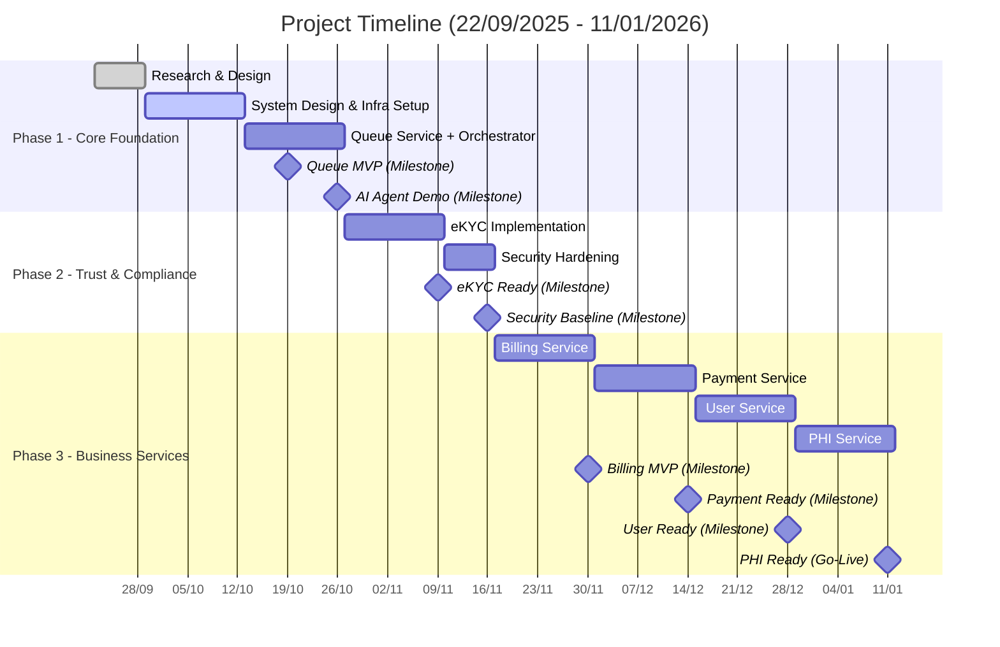
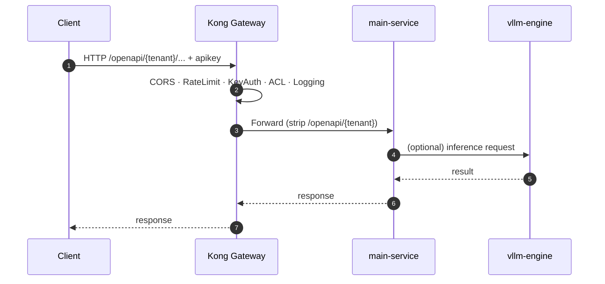
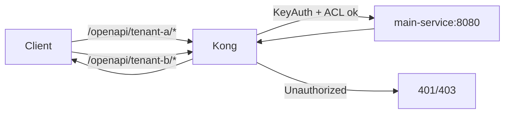

1. Vẽ Context Map (DDD) và liệt kê domain events chính.

2. Tách Orchestrator và NLU khỏi Core-service hiện tại.

3. Chuẩn hóa Auth flow: OIDC, eKYC as claim-enrichment (level_of_assurance), policy khi nào bắt buộc eKYC.

4. Chốt protocol matrix (REST/gRPC vs MQ) + idempotency keys.

5. Thiết lập observability (OTel, tracing headers qua Gateway→BFF→services).

6.  Định mô hình multi-tenant cho PHI/Billing, bổ sung audit bất biến.

7. Viết API & Event contracts (OpenAPI + AsyncAPI), thêm Pact tests.

8. Áp security baseline: mTLS nội bộ, Vault, secret rotation, WAF rules.

9. POC SAGA cho luồng: Bốc số → eKYC (nếu cần) → tạo hồ sơ → tính phí → thanh toán → cập nhật PHI.

10. Thiết lập SLO/alerts và kịch bản DR.

# 📅 Timeline chi tiết (bắt đầu 22/09/2025)

---

## **Phase 1 – Core foundation (W1–W5)**

- **W1 (22/09–28/09)**  
  🔹 Research, Requirement analysis, Planning, Architect design

- **W2 (29/09–05/10)**  
  🔹 System design (DB, API contract, dataflow, pattern)  
  🔹 Draft UI/sketch  
  🔹 Environment setup  
  🔹 Infra: gateway, logger, multi-tenant cơ bản

- **W3 (06/10–12/10)**  
  🔹 Frontend: màn hình chọn dịch vụ → chọn khoa → bốc số  
  🔹 Infra: multi-tenant config, message broker  
  🔹 Orchestrator + NLU (rule-based) + conversation flow

- **W4 (13/10–19/10)**  
  🔹 Frontend: voice/chat/text flow, kết nối backend/orchestrator  
  🔹 Backend: flow “bốc số” (issue/status/cancel)  
  🔹 Enhance “chỉ đường”, “thủ tục” (đã có base)

- **W5 (20/10–26/10)**  
  🔹 Frontend responsive  
  🔹 Enhance: AI agent (classifier/LLM)  
  🔹 Admin service: multi-tenant config  
  🔹 Test/Demo E2E (touch + chat + orchestrator + queue basic)

✅ **Milestone 1 (19/10): Queue MVP chạy end-to-end**  
✅ **Milestone 2 (26/10): Demo AI agent + multi-tenant admin**

---

## **Phase 2 – Trust & Compliance (W6–W8)**

- **W6–W7 (27/10–09/11)**  
  🔹 eKYC (OTP, ID, RBAC)

- **W8 (10/11–16/11)**  
  🔹 Security hardening (authN/authZ, audit, rate limit, logging, monitoring)

✅ **Milestone 3 (09/11): eKYC Ready**  
✅ **Milestone 4 (16/11): Security baseline**

---

## **Phase 3 – Business services (W9–W16)**

- **W9–W10 (17/11–30/11)**  
  🔹 Billing service (pricing rules, invoices, payout calc)

- **W11–W12 (01/12–14/12)**  
  🔹 Payment service (PSP integration, webhook, idempotency, retry)

- **W13–W14 (15/12–28/12)**  
  🔹 User service (profile, preferences, auth unify)

- **W15–W16 (29/12–11/01/2026)**  
  🔹 PHI service (records, masking, audit log, privacy rules)

✅ **Milestone 5 (30/11): Billing MVP**  
✅ **Milestone 6 (14/12): Payment Ready**  
✅ **Milestone 7 (28/12): User Service Ready**  
✅ **Milestone 8 (11/01/2026): PHI Service Ready – Project Complete**

## Architecture (Mermaid)

