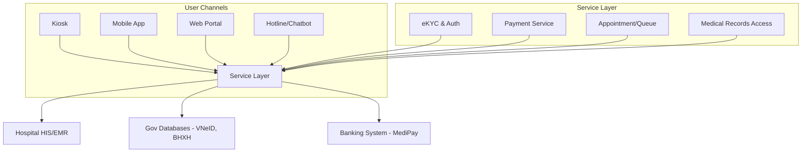
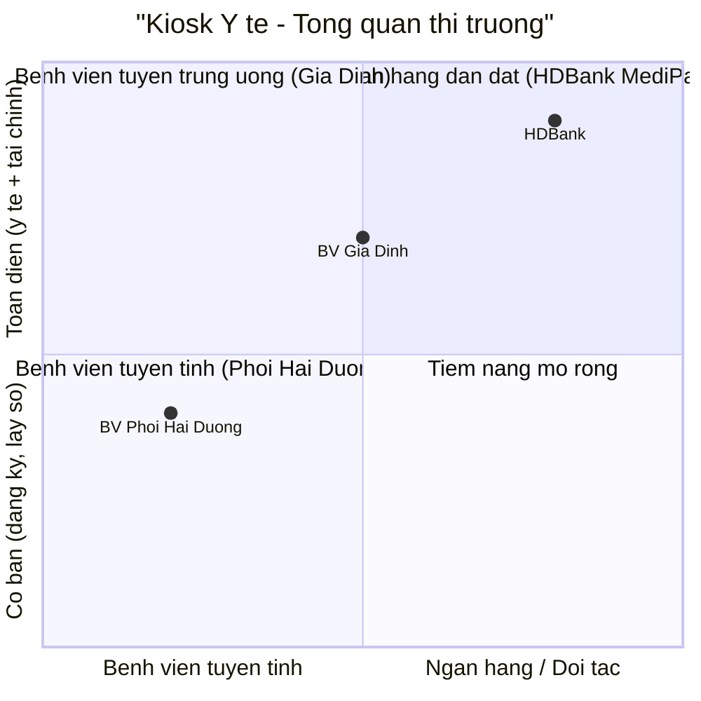

| Đơn vị triển khai        | Thiết bị ngoại vi                                                                            | Chức năng người dùng                      | Thanh toán                                     | Quản lý hồ sơ                                | Đặc điểm nổi bật                                           |
| ------------------------ | -------------------------------------------------------------------------------------------- | ----------------------------------------- | ---------------------------------------------- | -------------------------------------------- | ---------------------------------------------------------- |
| **HDBank (MediPay)**     | Camera, CCCD chip, QR reader, POSBANK X990, màn hình công nghiệp, máy in 80mm, UPS, cảm biến | Đăng ký KCB bằng CCCD/VNeID, eKYC         | Thanh toán QR/POS, mở tài khoản, tín dụng y tế | Lịch sử khám, sổ sức khỏe điện tử            | Kết hợp **y tế + tài chính**, mở rộng >120 kiosk toàn quốc |
| **BV Nhân Dân Gia Định** | Camera, CCCD chip, QR reader, POS, màn hình cảm ứng, máy in, UPS, khung kim loại             | Định danh, cấp số thứ tự tự động          | Thanh toán QR/POS                              | Liên thông HIS, chuẩn hóa dữ liệu (Đề án 06) | Triển khai lớn, phối hợp **Sở Y tế – PC06 – HDBank**       |
| **BV Phổi Hải Dương**    | CCCD chip, camera face ID, màn hình cảm ứng, máy in, máy tính công nghiệp                    | Đăng ký, phát số tự động, tra cứu dịch vụ | Chưa nổi bật (chủ yếu đăng ký)                 | Tra cứu thông tin, hỗ trợ hồ sơ              | Tuyến tỉnh, thử nghiệm, tập trung giảm chờ đợi             |

| **Bước** | **Nội dung**                      | **Giá trị**                       | **Phụ thuộc**                      |
| -------- | --------------------------------- | --------------------------------- | ---------------------------------- |
| **1**    | Bốc số, tư vấn thủ tục, chỉ đường | Nhanh, đã có service demo, có thể add TTS, STT          | Ít phụ thuộc, tự làm được          |
| **2**    | Tích hợp eKYC (CCCD, BHYT)        | Chuẩn hóa dữ liệu   | Hệ thống định danh (bên thứ 3)     |
| **3**    | Payment (QR/POS)                  | Cashless, minh bạch thu chi       | Cổng thanh toán (bên thứ 3)        |
| **4**    | Tra cứu hồ sơ bệnh án             | Giá trị dài hạn, nâng trải nghiệm | HIS/EMR bệnh viện, bảo mật dữ liệu |

